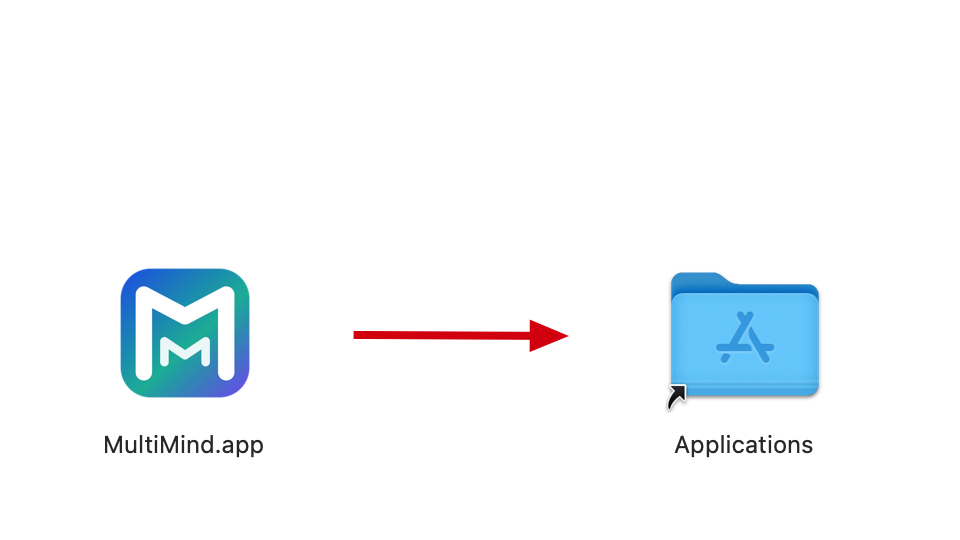

# MultiMind Flow

MultiMind Flow is a desktop workspace for discussing with multiple AI assistants and search engines side by side. It supports split-screen cells, a shared input box, and per-cell configuration.

## Install on macOS

Download the `.dmg`, open it, and drag **MultiMind Flow** into **Applications**.

The current MVP is not code-signed or notarized. On first launch, macOS Gatekeeper may show a warning such as "cannot verify the developer" or "the app is damaged and should be moved to the Trash." This is expected for the unsigned MVP build.

To open the app:

1. In Finder, open **Applications**.
2. Right-click **MultiMind Flow** and choose **Open**.
3. In the Gatekeeper dialog, choose **Open** again.
4. If macOS only shows a block message, open **System Settings → Privacy & Security**, find the blocked MultiMind Flow message, and choose **Open Anyway**.

Screenshot guide:



## Install on Windows

Download the `.exe` installer and run it.

The current MVP is not code-signed. Windows Defender SmartScreen may show "Windows protected your PC." This is expected for the unsigned MVP build.

To continue installation:

1. Click **More info**.
2. Click **Run anyway**.
3. Follow the installer steps.
4. Launch **MultiMind Flow** from the Start menu or desktop shortcut.

Screenshot guide:


## Packaging Verification

The macOS package is built as a Universal Binary. Before publishing a release, verify the app executable contains both Intel and Apple Silicon architectures:

```bash
lipo -info "release/mac-universal/MultiMind Flow.app/Contents/MacOS/MultiMind Flow"
```

The output must include both `x86_64` and `arm64`.
